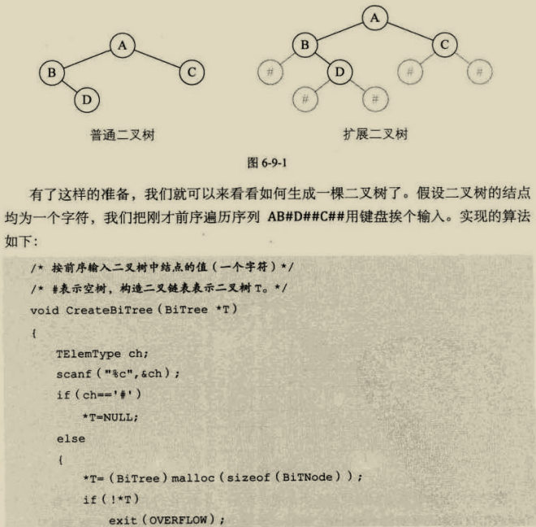
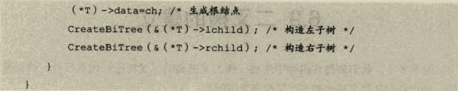

```
Content 1
1. 完全二叉树
2. 二叉树结点性质
3. 二叉树的建立
4. 链表存储
5. 前中后层traverse
6. 线索二叉树
7. 访问次数最小的Huffman Tree
```

*回溯与dfs适应，而队列与层序遍历~bfs适应，均有递归实现*

*二叉搜索树：左子<根节点<右子树*

### 1.  完全二叉树-满二叉树阉割——顺序存储


##  2. 二叉树-idoit property

​	1.叶总数=根总数+1
​	2.n结点深度为Llog2n_|+1
​	3.

### 3. build two-branches tree


### 4. 链表存储


### 5.二叉链表的遍历

前序：根节开始，前序遍历左子树，再前序遍历右子树(不断消叶子)
中序:前序:左-根-右
后序:先叶子(有同层叶子的话)后结点
层序:自根而下，自左而右

```
typedef struct TreeNode
{
    int data;
    TreeNode * left;
    TreeNode * right;
    TreeNode * parent;
}TreeNode;
 
void pre_order(TreeNode * Node)//前序遍历递归算法
{
    if(Node == NULL)
        return;
    printf("%d ", Node->data);//显示节点数据，可以更改为其他操作。在前面
    pre_order(Node->left);
    pre_order(Node->right);
}
```
### 6.线索二叉树——中序线索化
——省去判断为null然后返回，save time
——首尾结点前驱均指向T——首尾结点前驱遍历

## 森林—二叉树—树


### 7.David Huffman树

1. make 根节点形成带权路径和最小
2. 可用vector<int>存储，循环排序build tree

图的广度优先遍历可以使用递归实现吗？ - 秋溢路彭于晏的回答 - 知乎
https://www.zhihu.com/question/394494414/answer/1786394830