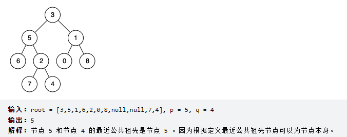

```
1.宽度优先搜索
2.深度优先搜索
3.B-树
4.AVL树
5.红黑树
```
1.
为什么这棵树如图而不是再root末尾加上null,null呢

2. AVL树
   1. 递归，如何保证插入根节点后，每个节点仍然平衡
   2. n>n+1,只要旋转一次足以平衡——分类讨论
   3. 每次~~旋转~~插入后使根节点及其子树均平衡
   4. when n,伸展树只把单个节点旋转为根
3. 红黑树
   1. ​

