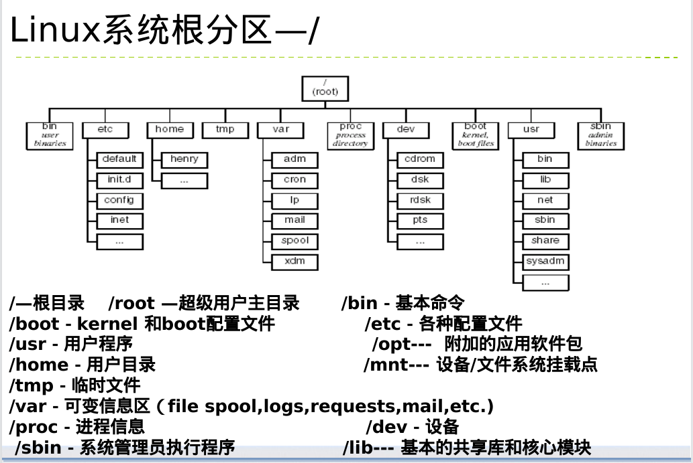

# 0. linux根目录详解

usr/local为系统程序
## [1. linux结构](../../水课/OS之linux/1.%20linux结构.md)

1\. 内核体系结构

## 2\. 命令行

sh->bash->c shell ->korn shell

## 3\. 磁盘

### 1\. 分区

#### 分区方案：

a) 至多4个主分区
//含一个主分区，一个扩展分区
//主分区第一扇区含MBR
//扩展分区=1～3个主逻辑分区+下级扩展分区
//11个逻辑分区建立在扩展分区(格式化不可使用）
***//主分区和逻辑分区相当于配置好环境，
扩展分区类似于格式化***
**gpt没有限制主分区个数**
b) extended分区不可安装目录=1-3主逻辑+senior拓展
**磁盘分区表表项**

**不同类型硬盘简介**

**IDE与SCSI硬盘的区别**https://blog.csdn.net/heimao0307/article/details/79493000
**ide与sata硬盘的区别**
SATA硬盘与IDE硬盘最大的区别在于接口标准。SATA硬盘是符合SATA接口标准的硬盘，IDE硬盘是符合PATA接口标准的硬盘。　　SATA硬盘与IDE硬盘在内部的机械结构和工作原理基本是一样的，差别在于与主板的连接。SATA硬盘使用串行通信方式与主板通信，其数据信号线很少，主要通过提高频率来提高传输速率；而IDE硬盘采用并行通信方式与主板通信，其数据信号线很多，采用的是多条线路同时传输信号的方式来提高速率。

PS:***本机为scsi接口hardware***

### 2.boot的使用

### 3.build swap partition

## 4\. disk practice

1.  fdisk -l //显示磁盘分区
    插入u盘前：
    
    插入u盘后：
    
    插入u盘相当于新建一个磁盘sda,
    sda1,sda2为responding disk 分区

# 磁盘管理与使用

## 1.分区的划分

$ ls /dev/sda*

//记得w保存

//查看分区位置

//查看分区组关系

//更改主分区类型（扩展分区才能化为逻辑分区）

//build logic partition

//删除分区

//half-finished

***ps：82-linux swap; 83-linux主/逻辑分区； 85-linux extended分区***

## 2\. 磁盘的挂载