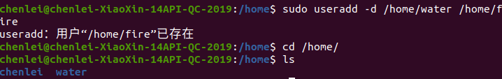
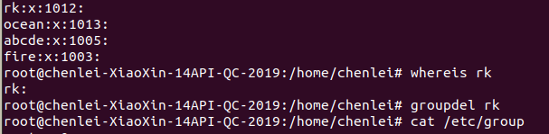
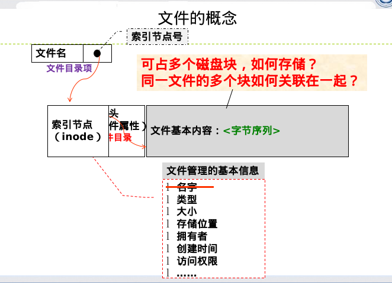
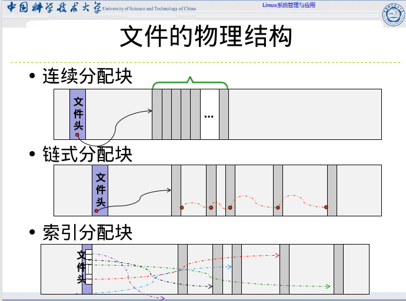
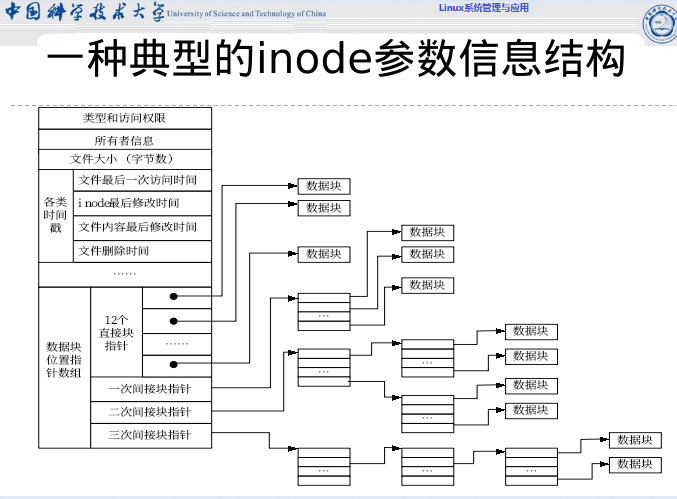
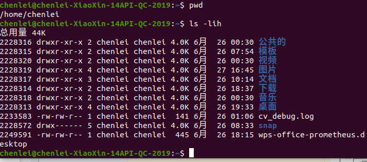
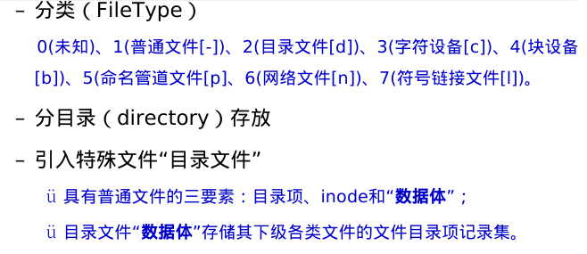
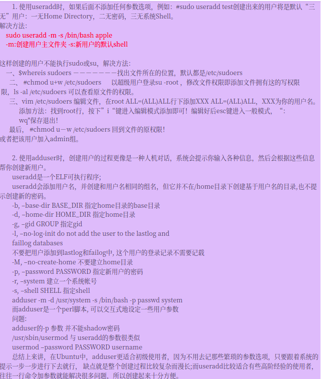
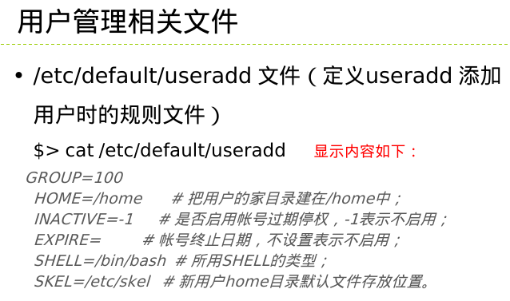
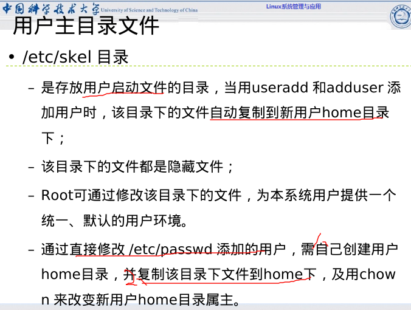

# 1\. ？ 如何在制定目录下新建用户



### 1.user基本命令

```
 useradd/userdel/usermod/passwd
        **passwd 只能变长，sudo passwd 可长可短**
        finger/id/chfn     su/sudo/visudo——快进到5. 
```

2\. delete group



# 2\. 文件内存组织




# 3\. inode参数(文件头attributes)



## 详解




# 4\. use用户

***新建用户***
$ sudo useradd -m -s /bin/bash tt
//=sudo useradd -d /home/fire -s /bin/bash fire
$sudo passwd tt //-m 自动生成家目录； -s 制定登陆使用bash $ ll /home 查看
$ $tail /etc/passwd ***查看shell类型***$ cat /etc/shells
***切换用户*** $su - tt
***快速建户*** $sudo adduser rk
***更改密码*** $passwd

# userdel 删除用户

sudo userdel tt

# 强制删除


***/home/fire 也可为用户名***

# 5\. 组的管理与使用

background：工作中常需要将多个用户统一权限，方便管理，
'‘’ $ groupadd ocean
‘’‘ $ usermod -g ocean water


