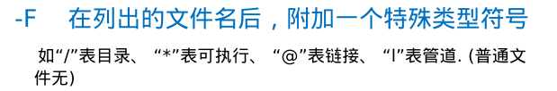
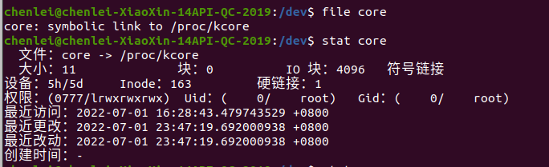
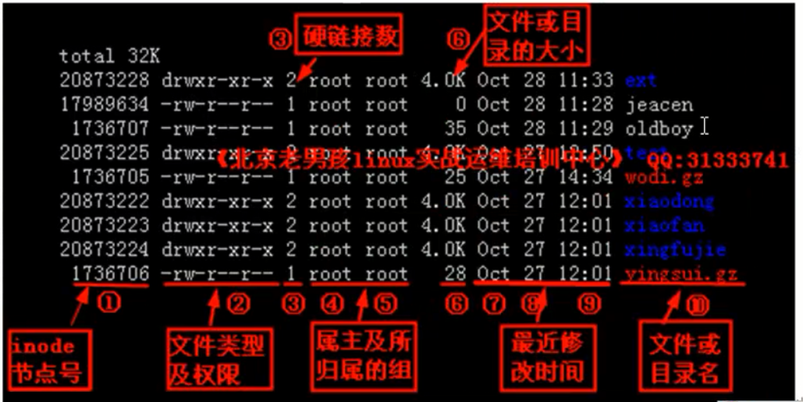
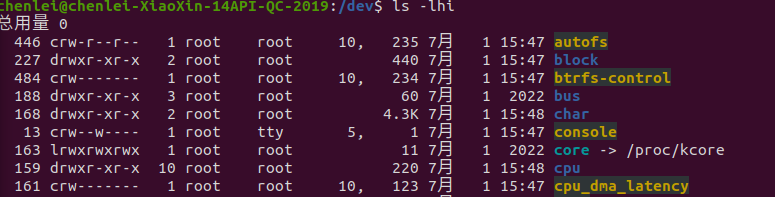
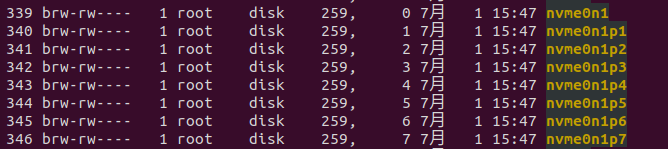
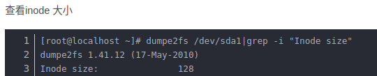
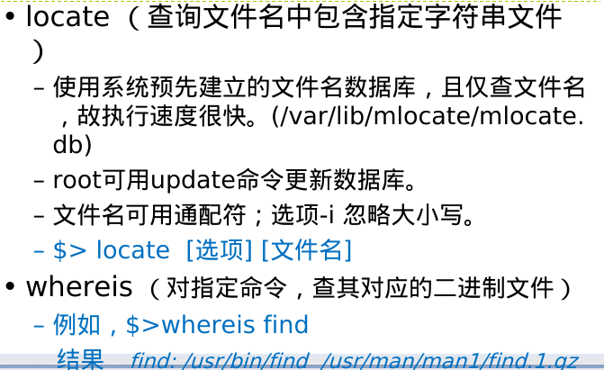
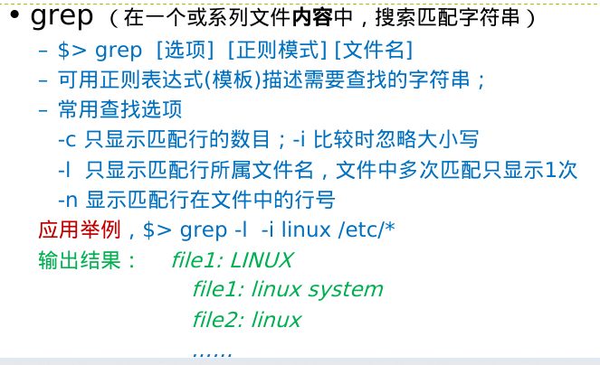

# 目录

```
1. vim
2. 文件操作0,0版
3. 权限
4. change mode 
```

## 1\. vim

w保存文件但不退出vi 编辑

:w! 强制保存，不退出vi 编辑

:w file将修改另存到file中，不退出vi 编辑

:wq保存文件并退出vi 编辑

:wq!强制保存文件并退出vi 编辑

q:不保存文件并退出vi 编辑

:q!不保存文件并强制退出vi 编辑

:e!放弃所有修改，从上次保存文件开始在编辑

## 2\. 文件操作0.0版

rm -r 递归 -f force
cp ——？
mv
**cat的高级应用与文本统计**

!\[bc3cd0d4b961adf248e8a03d433aed1f.png\](:/f496e2c747fc47dcbee34b2ec92a38e0

# [***linux 7文件***](http://t.csdn.cn/nU3jk)

普通文件+目录文件+块文件
链接文件

查看文件属性：



cdef盘

**文本terminal查看**
more or less
**数据库查找**

**grep:正则查找**


## 2\. 文件操作1.0版

常用选项:-f 强制 -i 交互 -r 递归
touch=mkdir + modify 文件操作time
ln -s d1 d2(软连接)
复制到d1文件下并改名 cp a.txt d1/b.txt
复制多个 cp -r book(book/) boom ../ai
mv f/d1 f/d2 (改名=删除+new name paste)
mkdir -p /home/xie/abc 不然单级

## 3\. 文件操作0.1版(补丁)

uname-system
hostname-主机名
history |less
dmesg=系统诊断、OSversion...
free=watch system 内存+virtual memory
ALT+1.2.3=终端控制台

## 3.0 权限

```
1. ~# # ~$ $
root 可以用chmod改变所有文件、目录的权限；普通用户只能用chmod修改属主是自己的文件的属性。
另外，根目录的属主(owner)是root，普通用户可以浏览根目录，但无法在根目录下创建文件或目录。
2. . .. 
```

## 3.1 chmod:change mode

chmod u+w
chmod u+s 强制写suid

#### 1.字母法：

chmod (u,g,o)(+-=)(rwx) file_name
u:所有者； g: 群成员；o:其他组； a:all;
+:add; -:delete; =:

#### 2\. 数字法

chmod 777 source2img.sh
u=7=111=rwx; g=rwx; o=rwx

## 4\. [linux进程管理之| || & &&](https://www.jb51.net/article/136261.htm)