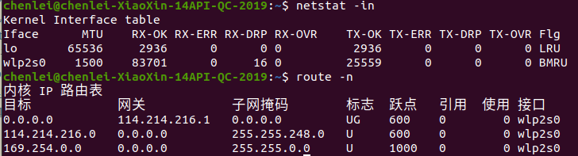
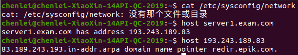
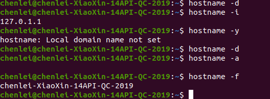

1.[ubuntu网络配置](https://blog.csdn.net/qq_38880380/article/details/99442543#commentBox)
2.ip地址、子网掩码、网关地址、

### 3.网络配置——/etc/目录详解
1. 配置info:	lspci(此即本地网络端口)—ifconfig eth0 up(激活)—192.180.1.1 netmask255.255.255.0 up(激活&配置)—down(禁用)
2. 配置命令——/etc/init.d/networking command
3. 本地hostname/host,ip/netmask/gateway/   检查所有:netstat -a check 接口: netstat -in
	
	DNS域名127.0.0.53通用	/etc/resolv.conf，
	
	一台PC默认一个网关route del default/add default...，
	检查连接：本地机 PING 制定ip traceroute -w/n/... ip
	修改local路由 route -...arp -a gateway&? info
	host命令是一个用于执行DNS查找的简单实用程序。它通常用于将名称转换为IP地址，反之亦然。 如果没有给出参数或选项，host将打印其命令行参数和选项的简短摘要。
	
	
	
### 4.ifconfig详解 
(http://t.csdn.cn/EWc5X)
	