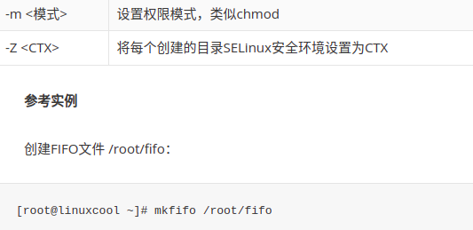

``` 
1. 进程-ps ,-pgrep; -kill, -exec
[进程脚本shell执行](http://t.csdn.cn/2sWbK)
2. 前后台管理
3. yum/apt/zip等软件包管理
4. 硬件管理
```
# 1.进程与脚本
[&(&),|(|)](https://www.jb51.net/article/136261.htm)
[命名pipe的创建与使用](https://www.jb51.net/article/116843.htm)
[2](http://t.csdn.cn/zJYDk)
