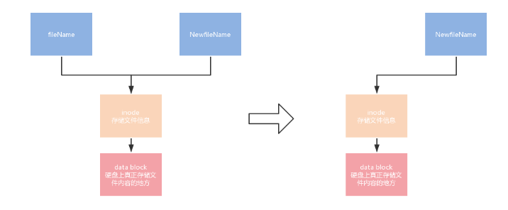

1.  sda是新建的，新建的在那里    //可以将磁盘或移动硬盘更改权限/删除再划分
	fdisk /dev/sdb 获得若干分区 fdisk -l   cat /dev/sdb1
2.  ~~为什么/mnt/dev找不到nvme0n1p1等等呢
3.  虚存的实现——为每一个进程创建一个虚存页表，其中只有部分表项映射到物理内存或磁盘(load to mm while needed)
4.  硬链接

软链接——newfilename指向filename
5. inode——superblock=set of inode's name——inode address——filetype、user、group\size\time node and datablock pointers
built on multiple disks——disk partition numbers&partition address&totalsize&authorities
