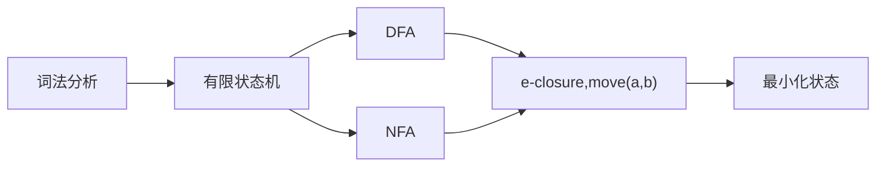
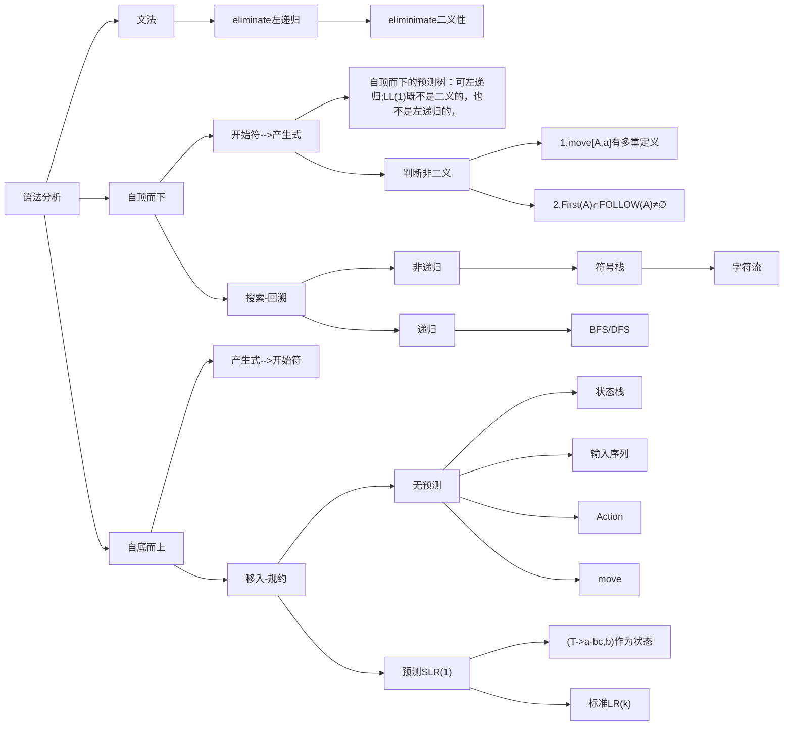
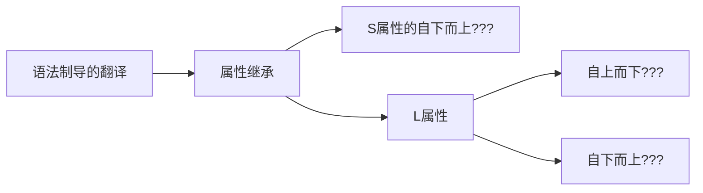
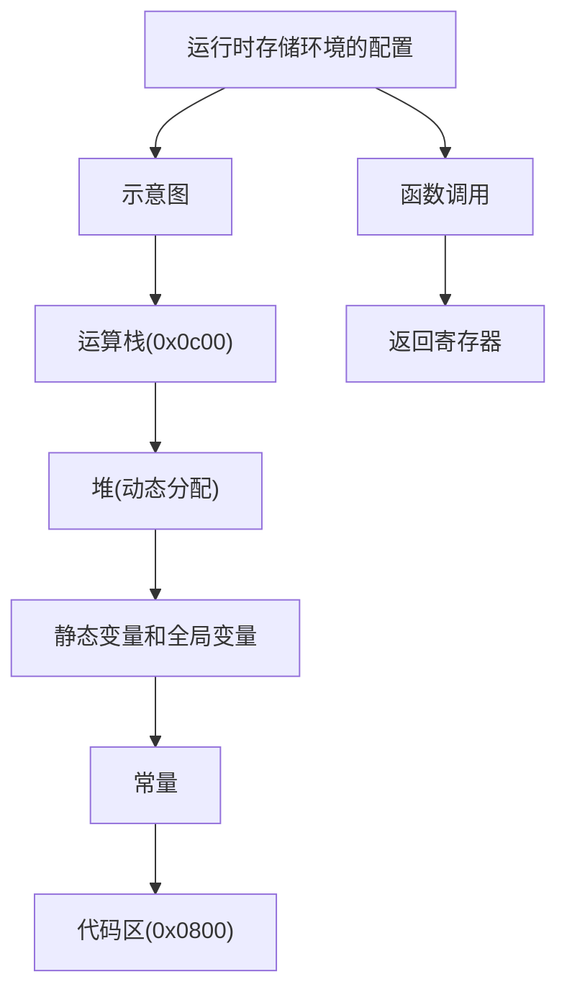

```mermaid
graph LR
1[词法分析]	
2[有限状态机]
3[DFA]
4[NFA]
5["e-closure,move(a,b)"]
6[最小化状态]
1-->2
2-->3
2-->4
3-->5
4-->5
5-->6
```


```mermaid
graph LR
1[语法分析]
2[文法]
1-->2
6[eliminate左递归]
3[eliminimate二义性]
1-->4
1-->5
5[自底而上]
4[自顶而下]
z4["开始符-->产生式"]
z5["产生式-->开始符"]
z6["自顶而下的预测树：可左递归;LL(1)既不是二义的，也不是左递归的，"]
z7["判断非二义"]
z8["1.move[A,a]有多重定义"]
z9["2.First(A)∩FOLLOW(A)≠∅"]
4-->z4
5-->z5
z4-->z6
z4-->z7
z7-->z8
z7-->z9
2-->6
6-->3
7[搜索-回溯]
4-->7
8[非递归]
9[递归]
7-->8
7-->9
a3[BFS/DFS]
9-->a3
a1[符号栈]
a2[字符流]
8-->a1
a1-->a2
10[状态栈]
11[输入序列]
12[Action]
13[move]
15-->10
15-->11
15-->12
15-->13
15[无预测]
14[移入-规约]
5-->14
14-->15
16["预测SLR(1)"]
14-->16
17["(T->a·bc,b)作为状态"]
16-->17
18["标准LR(k)"]
16-->18
```



```mermaid
graph LR
1[语法制导的翻译]
2[属性继承]
1-->2
3[S属性的自下而上???]
4[L属性]
5[自上而下???]
6[自下而上???]
2-->3
2-->4
4-->5
4-->6
```



```mermaid
graph TD
1[运行时存储环境的配置]
2[示意图]
3["运算栈(0x0c00)"]
4["堆(动态分配)"]
5[静态变量和全局变量]
6[常量]
7["代码区(0x0800)"]
1-->2
2-->3
3-->4
4-->5
5-->6
6-->7
8[函数调用]
1-->8
9[返回寄存器]
8-->9
```


```flow

```


```mermaid
graph LR
a[中间代码生成]
b[三地址表达式]
a-->b
```

