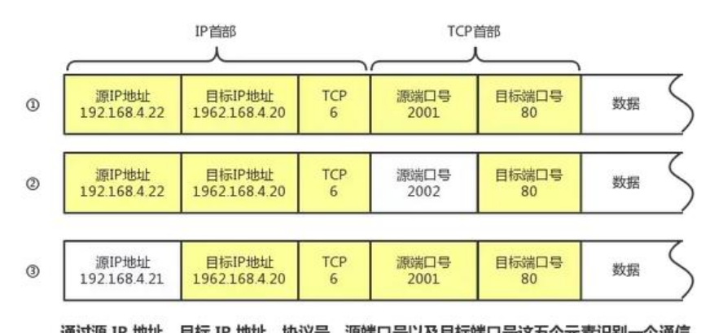
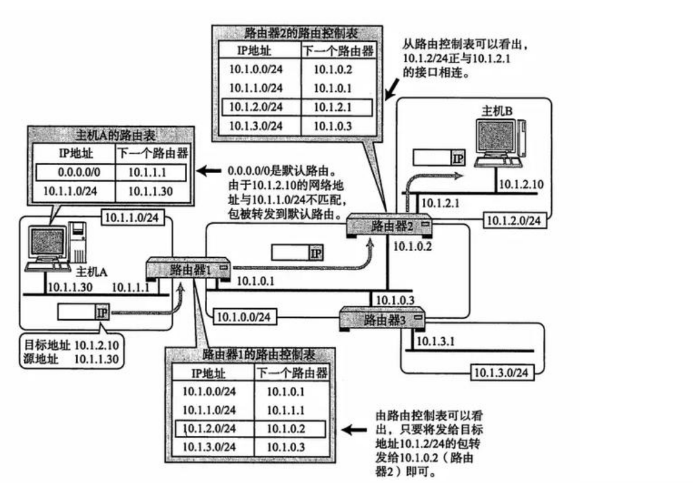
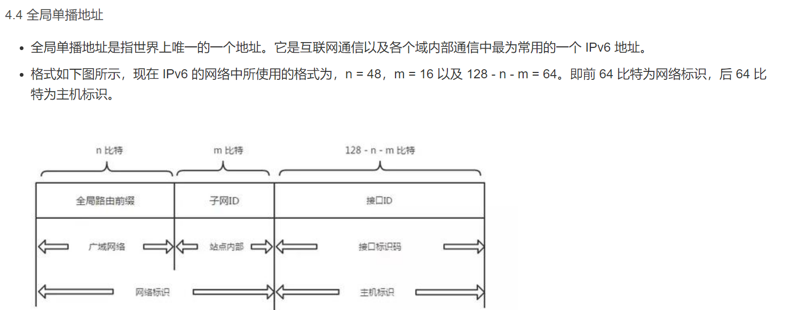
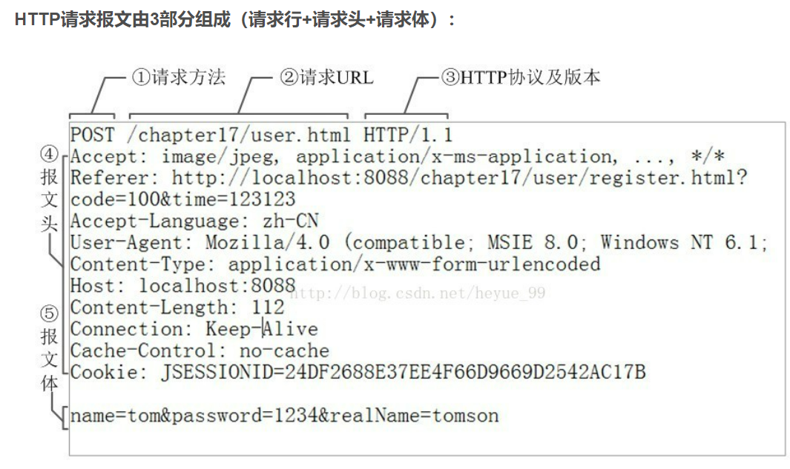
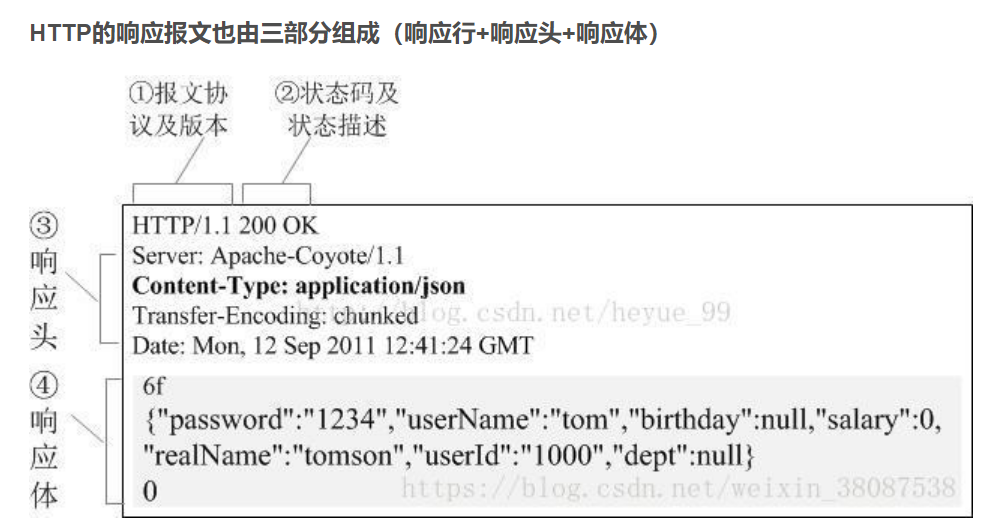

​	原理：分组交换、差错控制、流量与阻塞控制、信道分配

1. 服务器—(套接字)—(HTTP格式的文本）—(套接字)—客户端

2. HTTP format:
    a. request
    		i. request line=/GET /URL=服务器名+路径名/ HTTP version
    		ii. host  
    		iii. connection
    		iv. user agent 
    		v. connection language
    respond

    [套接字_百度百科](https://baike.baidu.com/item/%E5%A5%97%E6%8E%A5%E5%AD%97?fromModule=lemma_search-box)

**（已含TCP协议！！）**

IPv6（IP version 6）是为了根本解决 IPv4 地址耗尽的问题而被标准化的网际协议。IPv4 的地址长度为 4 个 8 位字节，即 32 比特。而 IPv6 的地址长度则是原来的 4 倍，即 128 比特，一般写成 8 个 16 位字节。

HTTP协议（HyperText Transfer Protocol，超文本传输协议）是用于从WWW服务器传输超文本到本地浏览器的传输协议。它可以使浏览器更加高效，使网络传输减少。它不仅保证计算机正确快速地传输超文本文档，还确定传输文档中的哪一部分，以及哪部分内容首先显示(如文本先于图形)等。

[http详解](http://t.csdn.cn/OXtzq)