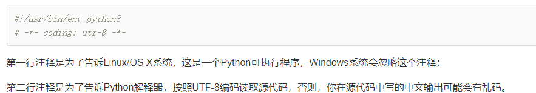

### 0 字符串与数据
	
### 1. datatype
	1. list.pop()
	2. list.append(x)
	3. list.insert(loca,x)
	4. dict.get('name')
### 2. function
	1. 返回多个值	
'import math 
def move(x,y,step,angle):
    nx=x+step*math.cos(angle)
    ny=y-step*math.sin(angle)
    return nx,ny
x,y=move(100,100,60,math.pi/6)
print(x,y)'
	2. default parameter
'1. def power(x, n=2):
    s = 1
    while n > 0:
        n = n - 1
        s = s * x
    return s'
2. 用enroll('Adam', 'M', city='Tianjin')，意思是，city参数用传进去的值，其他默认参数继续使用默认值。
3. persistentt对象 
def add_end(L=[])
	L.append('end')
	return L
add_end()	'end'
add_end()	'end''end'
L指向[];L指向不变，但自身append'end'
solution：L=None
**不变对象多任务环境不需加锁**
4. variable object
'def calc(*numbers):
    sum=0
    for n in numbers:
        sum=sum+n*n
    return sum
num=[2,4,6]

print(calc(*num))
5. 传入dict
Python的函数具有非常灵活的参数形态，既可以实现简单的调用，又可以传入非常复杂的参数。

默认参数一定要用不可变对象，如果是可变对象，程序运行时会有逻辑错误！

要注意定义可变参数和关键字参数的语法：

*args是可变参数，args接收的是一个tuple；

**kw是关键字参数，kw接收的是一个dict。

以及调用函数时如何传入可变参数和关键字参数的语法：

可变参数既可以直接传入：func(1, 2, 3)，又可以先组装list或tuple，再通过*args传入：func(*(1, 2, 3))；

关键字参数既可以直接传入：func(a=1, b=2)，又可以先组装dict，再通过**kw传入：func(**{'a': 1, 'b': 2})。

使用*args和**kw是Python的习惯写法，当然也可以用其他参数名，但最好使用习惯用法。

命名的关键字参数是为了限制调用者可以传入的参数名，同时可以提供默认值。

定义命名的关键字参数在没有可变参数的情况下不要忘了写分隔符*，否则定义的将是位置参数。
