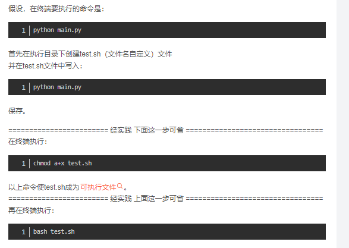

1. [python文件的相互调用](https://www.cnblogs.com/itech/archive/2010/06/20/1760345.html)
2. [tensorflow warning](http://t.csdn.cn/K9u9M)
## class
class python:
	def 	__init__(self,...):
		 	  self.attr=attr
class electricar(car)
	def   __init__(self)
			super().__init__(..)
    def  else
	
## file
	with open('...txt') as f
	import json
	json.load(xx)
	json.dump(xx)
	
## string
string.title()/.upper()/.lower()

## linux下执行shell文件

## [with](https://www.runoob.com/python3/python-with.html) 

	