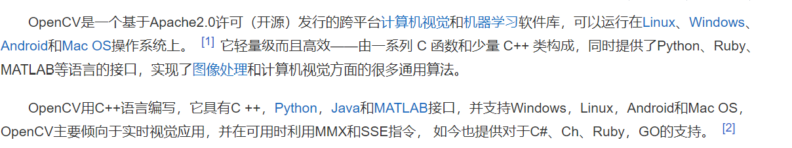

一个用python实现的科学计算，包括：1、一个强大的N维数组对象Array；2、比较成熟的（广播）函数库；3、用于整合C/C++和Fortran代码的工具包；4、实用的线性代数、傅里叶变换和随机数生成函数。numpy和稀疏矩阵运算包scipy配合使用更加方便。
___
pandas 是基于NumPy 的一种工具，该工具是为解决数据分析任务而创建的。Pandas 纳入了大量库和一些标准的数据模型，提供了高效地操作大型数据集所需的工具。pandas提供了大量能使我们快速便捷地处理数据的函数和方法。你很快就会发现，它是使Python成为强大而高效的数据分析环境的重要因素之一。
___

___
Matplotlib (可学), 偶尔会用来呈现误差曲线什么的
Tkinter (可学), 你可以自己用它来编写模拟环境
Pytorch/Tensorflow (可学), 后面实现神经网络与强化学习结合的时候用到
OpenAI gym (可学), 提供了很多现成的模拟环境