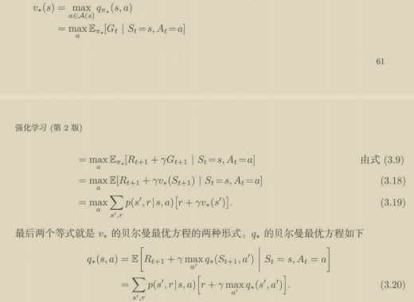

```
0.  concept arrangement
1.  多臂赌博机
2.  有限马尔可夫决策过程
3.  动态规划
4.  蒙特卡洛方法
5.  时序差分学习
```

0.  概念整理
    q*(a) 动作a的价值
    Q(a) 动作a价值的估计
    vΠ(s) 状态s下获得的回报的期望
    qΠ(s,a) 状态s执行动作a后获得的回报的期望
    //状态s下执行a的回报的期望可以是随机变量
    **贝尔曼最优状态/动作方程：**
	
1.  多臂赌博机
    
    1.  收益概率分布为定值
        
    2.  收益的概率分布vary with time but 平稳
        2'. reward的概率分布vary with time and 不平稳
        countermove: 给近期的收益更高权值
        
        Ri的权值为α(1-α)^(n-i),，
        **注意到αn(a)可随时间改变，使得调整更为合理，αn(a)=1/n可得采样平均**
        
        而αn(a)=α并不收敛
        //markdown math
    
    $$
    J_\alpha(x) = \sum_{m=0}^\infty \frac{(-1)^m}{m! \Gamma (m + \alpha + 1)} {\left({ \frac{x}{2} }\right)}^{2m + \alpha} \text {，行内公式示例} 
    
    
    
    $$
    
    3.1 初始估计不准确——乐观估计
    why make 振荡&bias
    3.2 最近发生的权重大且收敛/无偏——无偏恒定步长
    
    3.3 长远——越少发生的发生加权重
    
    还有那些要素
    进阶4.
    **应用**
    1.Q-learning恒定旧值估计新值
    
2.  SarSa直接旧值替代
    
3.  ?policy credient