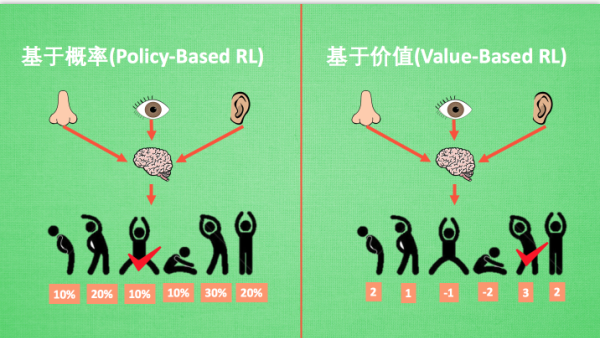
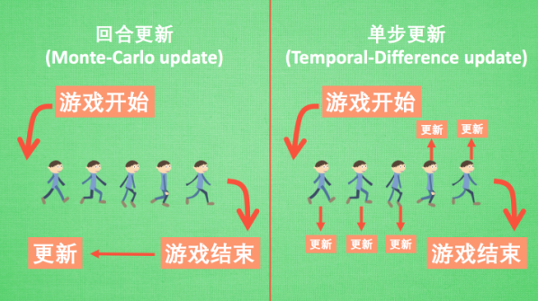

[教程必备与神经网络简介](https://yulizi123.github.io/tutorials/machine-learning/reinforcement-learning/1-2-requirment/#%E6%95%99%E7%A8%8B%E5%BF%85%E5%A4%87%E6%A8%A1%E5%9D%97)
1. 推荐课程——莫烦python 强化学习[https://yulizi123.github.io/tutorials/machine-learning/reinforcement-learning/]
2. 课程必备(python扩展包）——来自1-简介-课程要求
	1. 工具篇：
Numpy, Pandas (必学), 用于学习的数据处理
Matplotlib (可学), 偶尔会用来呈现误差曲线什么的
Tkinter (可学), 你可以自己用它来编写模拟环境
Tensorflow (可学), 后面实现神经网络与强化学习结合的时候用到
(建议用pytorch)[https://blog.csdn.net/qq_42257666/article/details/121361983]
OpenAI gym (可学), 提供了很多现成的模拟环境
	2. 机器学习预备知识——有趣的机器学习[https://yulizi123.github.io/tutorials/machine-learning/ML-intro/]
3. docker使用教程：
阮一峰的Docker入门教程(看上去比菜鸟教程舒适）[https://ruanyifeng.com/blog/2018/02/docker-tutorial.html]

这种命令(docker image ls)安装好docker后打开windows powershell 输入即可
4. git与python使用教程
[https://www.liaoxuefeng.com/wiki/896043488029600]

