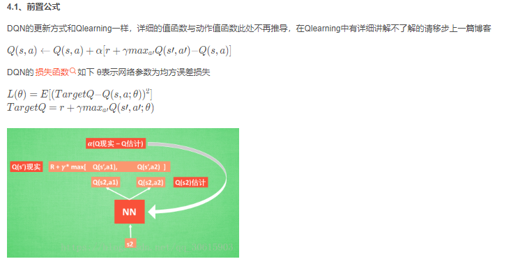
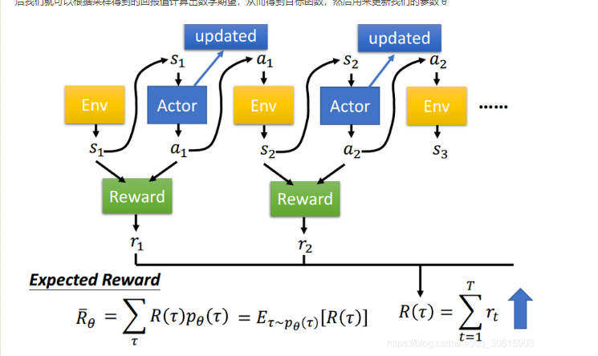

### 1.比较
\		a1	a2	a3	a4	...	am
s1
s2
...
sn
## 1&2. QL与SarSa

## 3\. DQL

**利用Q估计和Q现实的差值，反向传播，更快收敛**
*通常搭建两个神经网络，target\_net 用于预测q\_target 值，它不会及时更新参数，这组参数被固定一段时间，然后被eval_net 的新参数替换。***（Q(s',a';θ)为s' adopt a'获得的动作奖励）**

## [4\. Policy learning](http://t.csdn.cn/bb782)
它能在一个连续区间内挑选动作, 而基于值的, 比如 Q-learning, 它如果在无穷多的动作中计算价值, 从而选择行为, 这, 它可吃不消。
**先依照概率选择行为，再增加好行为的概率**!
//或者说先任意行动，然后选择为动作的拟合
而Q-learning，为选择Q最高的动作

**表明R(t)是θ的函数**

[5\. Actor-Critic=policy grdient+value-based](https://blog.csdn.net/qq_30615903/article/details/80774384)

## **[2.dqn_ppo总结](http://t.csdn.cn/mLH6Q)**