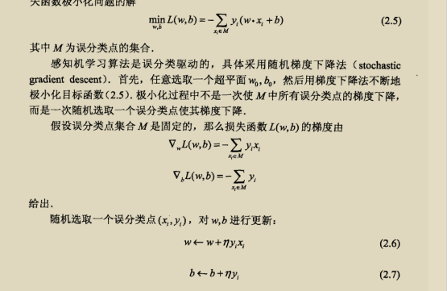

感知机是什么(模型)
___
根据输入向量，做线性变换
t=w*x+b;f(x)={1,t>=0;0,t<0}
在二维平面为二维线性分割

感知机的学习准则
1.  损失函数
	1. 0-1 loss: Σ f(xi)==yi
	2. 平方loss: sqrt(thegma(f(xi)-yi)^2)
	3. 交叉熵loss: thegma yi*logf(xi)
___
不是选择误分类点的总数——非参数w,b的连续可导函数
而是误分类点到超平面的总距离
误分类点满足-yi(w*xi+b)>0
2. 风险最小准则
	1. θ* min target
	2. ？正则化add what variable
#### application_howtomodify module?
	error back propagation:

更新算法的收敛性
___

	
	
	