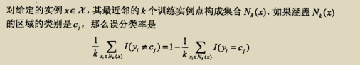

1. 判别方法介绍
___
寻找与输入x最近的k个实例，
以其中元素最多的类作为x的类属性
*同样也是离散，采用连续可导的距离来度量*
___
2. 学习准则
	1. loss function:
	
	//这个不可求导更新
	2. 风险最小=最小误差+正则化拥抱变化
___
3. 寻找定点k个近邻点的方法——kd树，不断二分缩小范围，将每个子点的半平面递归呈现
___
4. 优化器——无优化器
