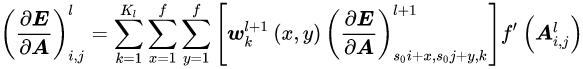
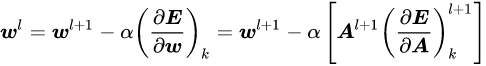
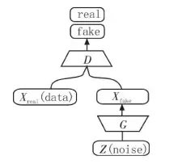
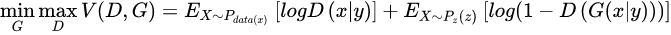
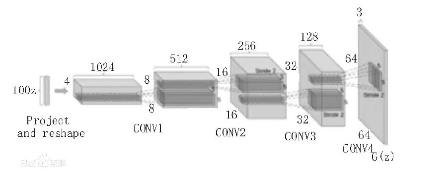
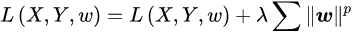
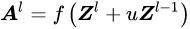

## 神经网络
输入层——特征图

隐含层——
	**特征图**
			1. 一维/2维卷积核
				Zl+1=∫Zl
			2. activiation function
				Al=f(Zl)
	池化层
			1. Lp池化 p=1 均值池化
			p=∞ 极大池化
			//分别为1阶/∞阶矩阵范数
			2. 随机/混合池化/中和想法
			Al=λL1(Al)+L∞(Al)
			3. 谱池化
			DFT(离散傅里叶变换——积分变为求和形式)    
			fourier逆变换可获得原来的信息
	圈全  
			3’ 全连接层会被全局均值池化取代
输出层——accord to 目标输出结果

## 学习范式
### 监督学习——反向传播算法
#### 全连接层

		
#### 池化层
池化层在方向传播中没有参数更新，误差分配
到合适的地方
#### 随机梯度下降的作用
### unsupervised learning
1. 卷积自编码器 Convolutional AutoEncoders 
	使用卷积层与池化层建立常规的卷积神经网络作为编码器，反卷积和向上池化作为解码器
2. 卷积受限铂尔曼机 Convolutional Restricted Boltzman Machines
	传统RBMh上将隐含层分为多个组，每个组内二元节点共享卷积核参数	
3. 卷积深度置信网络 Convolutional Deep Belief Networks	
//4 preface——**生成对抗网络
	
	生成白噪声变量Z作为初始，
	由D判断输入来自训练数据data还是生成，
	目标：	a. 使D尽可能判断数据来源
			 	b. 使G尽可能生成与X一致的数据来源
	过程: 	G不断修改使得D难以辨认，
				  D不断提高分辨率准确判断G/X
				  		此为对抗
条件(y)生成对抗网络：

信息(潜在编码c—x/z共同信息程度，like 方差/均值)对抗生成网络

4. 深度卷积生成对抗网络 Deep Convolutional Generative Adversarial Networks

	类似生成对抗网络生成一些假数据，传递给卷积神经网络，判定生成结果与预期结果的真假，
不断提高生成与判定质量
#### 设计要点：
1）将卷积网络中的池化层用相应步长的卷积层代替；
2）在生成模型和判别模型中都使用了批归一化层；
3）去掉了网络中的全连接层；
4）在生成模型中采用Re LU激活函数；
5）在判别模型中采用Leaky Re LU激活函数。
*足以以假乱真，但分辨率不太行*
**神经网络**
	输入—神经元选择策略处理—输出
	各层神经元(处理器)接受递质(I/O数据)形成网络
## 优化
1. 正则化

2. 分批归一化 Batch Normalization
3. skip connection
	
